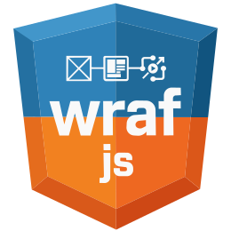
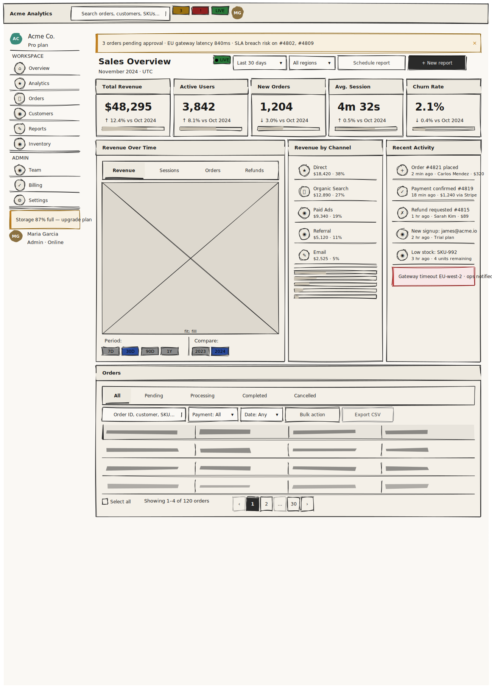

# Wrafjs
<div style="text-align: center;">
  
</div>


| **Caution Beta**|
|---|
|Wrafjs v1.0 is currently in **beta**. The language spec, control set, and toolchain are stable for experimentation but subject to breaking changes before the final release.|

## Links

- 🚀 **Live Demo**: [Try it out](https://play.wrafjs.dev/?example=dashboard)
- 📚 **Documentation**: [Read the docs](https://wrafjs.dev/)
- 👤 **Author**: [Fabian Berrelleza](https://www.linkedin.com/in/fabian-berrelleza-384310263/)

Wrafjs is a Domain-Specific Language (DSL) designed to describe UI wireframes as structured text. While technical in nature, its heart lies in **reconnecting designers and developers with the creative process**. It is purpose-built to be processed by **Large Language Models (LLMs)** and rendered instantly as a digital sketch.

## The Creative Philosophy: Thinking by Sketching

In a precision-first industry, we often fall into the trap of "premature polish"—spending hours on pixels before validating the core idea. Wrafjs embraces the power of **Hand-Drawn Thinking**:

*   **Focus on Strategy, Not Pixels**: By staying in low-fidelity longer, you ensure the UX and functional flow are solid before worrying about aesthetics.
*   **The Speed of Thought**: Sketching is the fastest way to explore multiple ideas. Wrafjs brings this speed to the AI era, allowing you to iterate through dozens of layouts in seconds.
*   **Collaborative Freedom**: Sketches are inherently inviting. They signal that an idea is "in progress," encouraging feedback and preventing the psychological barrier of "finishing" a design too early.
*   **Non-Linear Creativity**: Wrafjs allows you to describe interfaces as you think of them, removing the friction of complex design tools.

## Why Wrafjs?

Wrafjs bridges the gap between the traditional sketchpad and modern AI workflows:

1.  **AI-Native**: Optimized for token efficiency (estimated **80% token savings**) and predictable structure, making it the perfect language for LLMs to brainstorm with you.
2.  **Instant Visualization**: See your "thought on paper" rendered immediately using a hand-drawn aesthetic (Rough.js).
3.  **Iterative Agility**: Change a single line of text to pivot your entire layout, maintaining creative momentum without technical overhead.
4.  **Versionable Design**: Since it's pure code, your UI is now part of your Git workflow.

## The Power of Design as Code

By treating wireframes as versionable text, Wrafjs introduces software engineering best practices to the creative process:
*   **Historical Comparison**: Use `git diff` to see exactly how a UI evolved over time, line by line. No more opaque binary blobs.
*   **Single Source of Truth**: The code *is* the documentation. It's always up to date and easy to audit.
*   **Collaborative Freedom**: Branching and merging designs is now as easy as merging code.
*   **Accessibility**: Non-technical users can describe changes in natural language, and an LLM can apply them directly to the `.wraf` file.

### Core Pillars

- **Token Efficiency**: No unnecessary decorative syntax or boilerplate.
- **Single-File Architecture**: A complete screen is defined in a single `.wraf` file.
- **Determinism**: There is only one clear way to express each UI concept.
- **Sketch Rendering**: Uses a "hand-drawn" aesthetic (Rough.js) to emphasize prototyping.

## Preview

<a href="https://play.wrafjs.dev/?example=dashboard">
  
</a>

Click the image to open a **live demo** in the playground.


## Use with any AI assistant

The file [`wrafjs_llm.md`](wrafjs_llm.md) in this repository is a **self-contained prompt attachment** that gives any LLM the full language spec it needs to generate valid `.wraf` code.

### How it works

1. Open your AI assistant of choice (ChatGPT, Claude, Gemini, Copilot, etc.)
2. Attach `wrafjs_llm.md` to the chat
3. Ask it to generate a screen — for example:

   - *"Using wrafjs, generate a school administration dashboard for a college"*
   - *"Using wrafjs, generate a mobile login screen with email and password"*
   - *"Using wrafjs, generate an e-commerce product listing page with filters and a search bar"*
   - *"Using wrafjs, generate a SaaS settings page with account, billing, and security tabs"*
   - *"Using wrafjs, generate a kanban board with three columns: To Do, In Progress, Done"*
   - *"Using wrafjs, generate an analytics dashboard with KPI cards and a data table"*

4. Copy the generated `.wraf` code
5. Paste it into [play.wrafjs.dev](https://play.wrafjs.dev/?new=1) and see your wireframe instantly

The LLM guide teaches the model to omit redundant defaults, use semantic controls, and produce the shortest possible code that expresses your layout intent.


## Quick Start: Hello World
```wraf
Screen HelloWorld {
  width: 800
  height: 600

  Card {
    position: center
    width: 300
    Text { text: "Hello Wrafjs!" variant: title align: center }
    Button { text: "Get Started" variant: primary }
  }
}
```

## Running the Playground

The repository uses a **pnpm monorepo** structure. The `apps/playground` app depends on the local workspace packages (`@wrafjs/controls`, `@wrafjs/layout`, `@wrafjs/parser`, `@wrafjs/renderer`), so you need to install dependencies from the root before running anything.

### Prerequisites

- [Node.js](https://nodejs.org/) v18 or higher
- [pnpm](https://pnpm.io/) v8 or higher (`npm install -g pnpm`)

### Steps

1. **Clone the repository**
```bash
   git clone https://github.com/your-org/wrafjs.git
   cd wrafjs
```

2. **Install all dependencies** from the monorepo root
```bash
   pnpm install
```

   This resolves all workspace packages (`@wrafjs/*`) used by the playground.

3. **Start the playground dev server**
```bash
   cd apps/playground
   pnpm run dev
```

   Or, from the root:
```bash
   pnpm --filter playground run dev
```

4. Open your browser at `http://localhost:5173` (Vite's default port).

### Project Structure
```
wrafjs/
├── apps/
│   └── playground/       # Interactive editor & live renderer
└── packages/
    ├── controls/         # @wrafjs/controls — UI control definitions
    ├── layout/           # @wrafjs/layout   — layout engine
    ├── parser/           # @wrafjs/parser   — .wraf parser
    └── renderer/         # @wrafjs/renderer — Rough.js sketch renderer
```